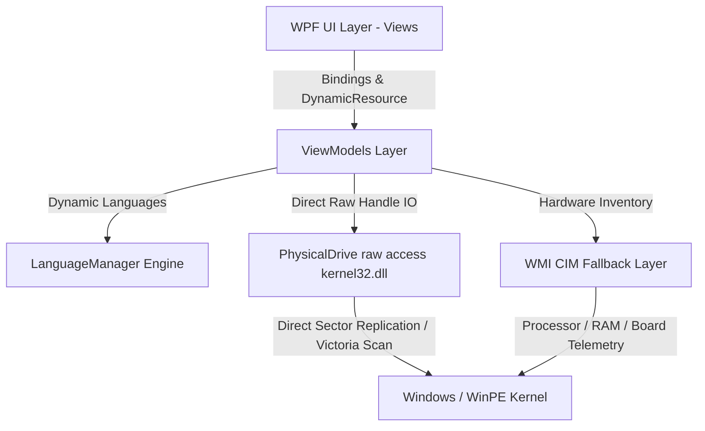

```text
    ___    ____   _______  __  __
   /   |  / __ \ / ____/ \ \/ /
  / /| | / /_/ // __/     \  / 
 / ___ |/ ____// /___     /  \ 
/_/  |_/_/    /_____/    /_/\_\
```

# 🌌 Apex Diagnostics Suite v1.0.0

[](https://github.com/)
[](https://github.com/)
[](https://github.com/)
[](LICENSE)

An elite, high-performance hardware diagnostic, recovery, and disk cloning utility engineered in C# WPF and optimized for direct bootable **WinPE deployments** as well as live Windows environments. Apex Diagnostics provides system builders, technicians, and power users with low-level bare-metal hardware telemetry and robust data rescue utilities.

---

## 🛠 Project Architecture & Technical Stack

The suite is engineered around the **MVVM (Model-View-ViewModel)** design pattern with a custom-built dynamic resource dictionary overlay engine for real-time multilingual scaling.



### Core Technologies
* **Framework**: .NET 8.0 WPF (Windows Presentation Foundation)
* **API Integrations**: Native `kernel32.dll` physical drive handle streaming (`CreateFile`, `ReadFile`, `WriteFile`).
* **Telemetry Queries**: Deep WMI query pipeline mapping fallback layers for bare-metal WinPE compatibility.
* **Aesthetics**: Sleek Sci-Fi Dark Theme styled using high-end vector structures, custom Gauges, and CSS-like styling tokens.

---

## 📸 Key Features & System Modules

### 1. 📊 System Overview Dashboard
* Real-time CPU, Memory, and Disk deep temperature indicators utilizing custom-drawn vector gauges with auto-wrapping dynamic labels.
* Net-telemetry throughput visualizers mapping live upload/download speed and peak performance rates.

### 2. ⚡ CPU Stress & Validation Engine
* Multi-threaded core torture testing targeting all logical processors.
* **Safety Watchdog Ceiling**: Configurable critical temperature threshold that auto-halts testing immediately if thermal parameters are violated, protecting the target system.
* Real-time thermal throttling monitoring and instruction set checks.

### 3. 🧠 Memory Toxicity Diagnostics
* Asynchronous high-performance RAM diagnostics with live Sector Map memory grids mapping allocations.
* Support for quick validation passes and exhaustive deep pattern coverage scans.

### 4. 🔍 Victoria-Style Disk Surface Scan
* High-precision sector verification leveraging direct physical drive handles (`\\\\.\\PhysicalDriveX`).
* Real-time block latency profiling classified into **6 custom speed groups**:
  * 🟢 Good (< 50ms)
  * 🟡 Slow (< 150ms)
  * 🟠 Delayed (< 200ms)
  * 🔴 Weak (< 1000ms)
  * 🟣 Timeout (> 5000ms)
  * 🛑 Bad / Error (Block Damage)

### 5. 📁 File Explorer & Asynchronous Data Rescue Wizard
* Dynamic file manager displaying partition maps, hidden volumes, and drive contents.
* **Quick Data Rescue**: An asynchronous copy engine built to rescue user profiles, desktop documents, DPAPI offline credentials vaults, and system keys directly to target recovery drives.

### 6. 💿 Low-Level Disk Cloner & Duplicator
* Bare-metal sector-by-sector replication for exact drive migrations, hidden recovery partitions, and OS backups.
* Double-buffered 4MB block size raw handle writing for extreme speed.
* **Wipe Safeguard Card**: A prominent, color-coded threat confirmation panel outlining source read-only channels versus destructive wipe targets with local validation safeguards (`CLONE` / `KLONLA`).

---

## 📂 Directory Structure

```text
Apex/
├── README.md                          # Repository Landing Page
├── .gitignore                         # Professional Build/Cache Exclusions
├── Build-WinPE-Desktop.ps1            # Automating WinPE Boot ISO Generation
├── Build-ISO.bat                      # ISO Builder Entry
└── ApexDiagnostics/                   # WPF Main Source Project
    ├── App.xaml                       # Global Styles & Base Resources
    ├── MainWindow.xaml                # Core Window & Shell Navigation
    ├── Controls/                      # Custom-Drawn Custom Vector Controls
    │   ├── CircularGauge.cs           # Auto-Wrapping Text Metric Gauge
    │   └── LiveGraph.cs               # High-Performance Sci-Fi Chart
    ├── Helpers/                       # Utilities & Core Extensions
    │   ├── LanguageManager.cs         # Dynamic Language Overlay Mechanism
    │   └── Converters.cs              # Localized Status Value Converters
    ├── Resources/                     # Localization Dictionaries
    │   ├── Strings.en.xaml            # English Translation Pack
    │   ├── Strings.tr.xaml            # Turkish Translation Pack
    │   └── Strings.de.xaml            # German Translation Pack (Fallback)
    ├── ViewModels/                    # MVVM Application Logic Models
    │   ├── DashboardViewModel.cs      # Core Telemetry Engine
    │   ├── CpuTestViewModel.cs        # Stress Tester Logic
    │   ├── DiskScanViewModel.cs       # Victoria-Style Raw Verification
    │   └── CloneViewModel.cs          # Raw Handle Sector Duplicator
    └── Views/                         # UI Views (XAML Templates)
```

---

## 🚀 How to Share & Maintain the Project (GitHub Guidelines)

To share this project globally while ensuring your master copy **never breaks**, follow this professional developer workflow:

### 1. Protect Your Main Branch (`main`)
* **Branch Protection Rules**: Once pushed to GitHub, go to **Settings > Branches** and enable protection for `main`. Require a **Pull Request (PR)** and at least 1 review before code can be merged.
* **Development Branching**: Always develop new features on separate branches, e.g., `feature/german-translations` or `bugfix/scan-latency-rounding`.

### 2. GitHub Push Instructions

Open your PowerShell terminal in the repository root directory and run:

```powershell
# 1. Initialize local git repository
git init

# 2. Stage all files (our .gitignore is pre-configured to exclude large build artifacts)
git add .

# 3. Commit your initial clean state
git commit -m "Initial commit - Apex Diagnostics Suite v1.0.0"

# 4. Create a main branch
git branch -M main

# 5. Connect to your GitHub repository (replace with your repository url)
git remote add origin https://github.com/YOUR_USERNAME/ApexDiagnostics.git

# 6. Push to GitHub
git push -u origin main
```

---

## 📷 Adding Screenshots Later
If you want to showcase real screenshots of your application on GitHub:
1. Capture screenshots of the running app on your machine.
2. Create a folder named `/Assets/` in the root of the project.
3. Save your images inside that folder (e.g. `Assets/dashboard.png`).
4. In this `README.md`, simply reference them using:
   ```markdown
   
   ```

---

## 📦 Building from Source

To compile the binaries:

```powershell
# Navigate to the project folder
cd ApexDiagnostics

# Build the optimized win-x64 binary
dotnet build --configuration Release
```

---

## 📄 Licensing

This project is licensed under the **MIT License** - see the [LICENSE](LICENSE) file for details. Any open-source libraries used (e.g. LibreHardwareMonitor, standard WPF helper frameworks) are fully free and open for public distribution, with no legal or copyright restrictions.
