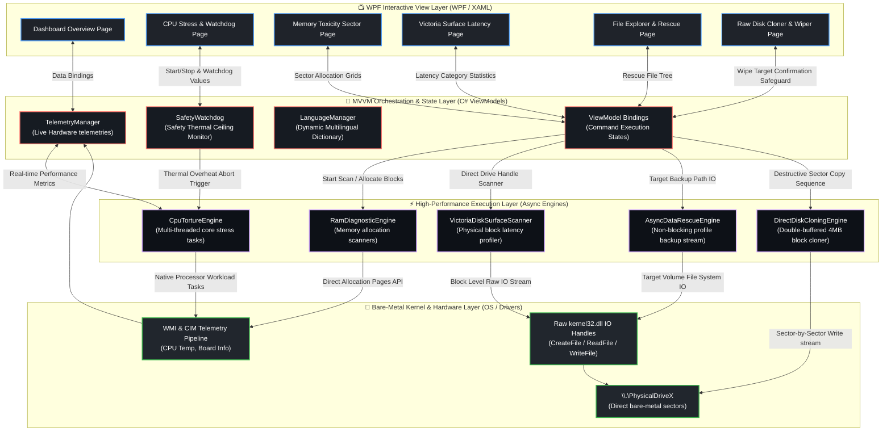

<p align="center">
  
</p>

<h1 align="center">🌌 Apex Diagnostics Suite v1.0.0</h1>

<p align="center">
  <strong>An elite, high-performance hardware diagnostic, recovery, and raw disk cloning utility engineered in C# WPF.</strong>
  <br />
  <sub>Optimized for bare-metal WinPE deployment and live IT infrastructure recovery workflows.</sub>
</p>

<p align="center">
  <a href="#-core-modules"></a>
  <a href="#-architecture--technical-stack"></a>
  <a href="#-localization--multilingual"></a>
  <a href="LICENSE"></a>
</p>

<p align="center">
  <a href="#-core-modules">Core Modules</a> •
  <a href="#-architecture--technical-stack">Architecture</a> •
  <a href="#-directory-structure">Directory Structure</a> •
  <a href="#-github-publishing-workflow">Publishing Workflow</a> •
  <a href="#-build--deployment">Build Guide</a>
</p>

---

## 💎 Project Philosophy & Design Language

Apex Diagnostics is not just another hardware tester; it is an industrial-grade diagnostics platform engineered for IT professionals, system integrators, and data rescue technicians. 

### 🌟 Premium Features Grid

| Component | Engineering Detail | Operation Mode | Core API / Library |
| :--- | :--- | :--- | :--- |
| **📊 Overview Dashboard** | Multi-vector responsive hardware gauges with auto-wrapping dynamic labels. | Live Telemetry | `WPF DrawingContext` |
| **⚡ CPU Torture Engine** | Thread-safe, load-aware multi-core stress testing with Safety watchdog ceilings. | Heavy Multithreaded | `System.Threading.Tasks` |
| **🧠 Memory Toxicity** | Dynamic sector map visualizing live allocations and patterns. | Exhaustive RAM Scan | Direct Allocation Page API |
| **🔍 Surface Verification** | Victoria-style low-level block sector latency profiling. | Physical Disk IO | `kernel32.dll` (Raw Handles) |
| **📁 Data Rescue Wizard** | Asynchronous backup for user documents, offline credentials, and security keys. | Non-blocking Copy | Asynchronous IO Stream |
| **💿 Disk Cloner & Wiper** | Sector-by-sector drive cloning with local threat verification safeguards. | Bare-Metal Duplication | `kernel32.dll` (Direct Sectors) |
| **🩺 S.M.A.R.T. Analyzer** | Queries direct disk firmware logs for sector health and power-on hours telemetry. | Hardware Queries | WMI `root\wmi` (FailurePredictData) |
| **🚀 Win10XPE Ready** | Fully compatible with custom Win10XPE integration for advanced diagnostics. | WinPE Deployment | Native WPF Hardware Fallback |

---

## ⚡ Core Modules

### 1. 📊 Real-Time Telemetry Dashboard
Custom-drawn high-fidelity vector gauges showing immediate CPU load, memory utilization, and hardware temperatures.
* **Auto-Wrapping Labels:** Labels automatically adjust text flow based on the selected language, preventing UI clipping.
* **Network Throughput:** Dynamic visualizers showing active upload/download speeds and peak bandwidth performance.

### 2. 🛡️ CPU Torture & Safety Watchdog
Torture-tests the processor under full workload while monitoring thermal safety parameters.
* **Safety Watchdog Ceiling:** User-defined temperature limit. If the CPU temperature exceeds this ceiling, the engine instantly halts all testing threads to protect the target system.
* **Instruction Set Validation:** Telemetry verifying AVX, AVX2, and SSE support registers.

### 3. 🧠 Memory Toxicity Scanner
Scans memory sectors asynchronously to detect soft errors, bad chips, and cell charge leakages.
* **Live Sector Grid:** Visualizes memory blocks as they are tested.
* **Quick & Deep Passes:** Support for brief validation tests as well as exhaustive testing runs.

### 4. 🔍 Victoria Disk Scan & S.M.A.R.T. Analyzer
Direct physical sector read analysis combined with active hardware firmware S.M.A.R.T. diagnostics.
* **S.M.A.R.T. Telemetry Decoding:** Decodes WMI raw bytes (`FailurePredictData.VendorSpecific`) to fetch reallocated sector counts (ID `0x05`), Power-On hours (ID `0x09`), and remaining SSD lifetime wear-leveling (ID `0xE7`/`0xAD`).
* **Interactive UI Health Pill Badges:** Dynamic, color-coded rounded pills (Green, Yellow, Red) showing exact drive health percentage alongside comprehensive disk status.
* **Block Latency Profiling:** Classifies sectors into **6 precise speed categories**:
  * 🟢 **Good (< 50ms):** Excellent health.
  * 🟡 **Slow (< 150ms):** Normal read speeds.
  * 🟠 **Delayed (< 200ms):** Mild latency.
  * 🔴 **Weak (< 1000ms):** Sector degradation signs.
  * 🟣 **Timeout (> 5000ms):** Severely degraded sector.
  * 🛑 **Bad (Error):** Damaged block.

### 5. 💿 Raw Disk Cloner & Wipe Safeguard
Engineered for migration to SSDs or cloning unstable, failing drives.
* **Low-Level Sector Duplication:** Sector-by-sector copying using raw disk handles (`\\\\.\\PhysicalDriveX`).
* **Wipe Safeguard Card:** Highlighted safety warning card outlining source and target disks with explicit user confirmation prompts to prevent data loss.

### 6. 💿 Win10XPE Deployment Integration
Apex Diagnostics and ApexShell are fully optimized to run inside custom Win10XPE diagnostic builds.
* **Software-Only Rendering Fallback:** Automatically overrides GPU hardware acceleration at startup to render crisp UI screens on systems lacking graphics drivers.
* **Win10XPE Startup Shell:** Replace the default shell or configure it via `PECmd.ini` to load `ApexShell.exe` instantly at boot.
* **Standalone Portable Executables:** All output files are compiled as self-contained binaries, ensuring they execute on bare-metal environments with zero dependencies.

---

## 🛠 Architecture & Technical Stack



---

## 📂 Directory Structure

```text
Apex/
├── README.md                            # Professional Repo Landing Page
├── .gitignore                           # Excludes VS Cache, Bin, Obj, and WinPE Temp files
├── Build.bat                            # Application compilation script (dotnet publish launcher)
├── Explorer++.exe                       # Standalone portable file manager used by Shell
└── ApexDiagnostics/                     # WPF Core Project Source
    ├── App.xaml                         # Styles, Brushes, and Global Configurations
    ├── MainWindow.xaml                  # Application Frame and Navigation Shell
    ├── Controls/                        # Custom UI Elements
    │   ├── CircularGauge.cs             # Auto-wrapping vector telemetry gauge
    │   └── LiveGraph.cs                 # Real-time data visualization chart
    ├── Resources/                       # Localization & Dictionary Packages
    │   ├── Strings.en.xaml              # English language packs
    │   ├── Strings.tr.xaml              # Turkish language packs
    │   └── Strings.de.xaml              # German language packs
    ├── ViewModels/                      # MVVM Logic Components
    │   ├── DashboardViewModel.cs        # Real-time stats manager
    │   ├── CpuTestViewModel.cs          # Thread-safe stress routines
    │   ├── DiskScanViewModel.cs         # Latency scanner controller
    │   └── CloneViewModel.cs            # Sector cloner VM with confirmation safeguards
    └── Views/                           # UI Templates (XAML Views)
```

---

## 🌍 Localization & Multilingual

Apex Diagnostics supports dynamically toggled languages at runtime. If you wish to translate the app:
1. Create a copy of `Strings.en.xaml` under `Resources/`.
2. Name it using your language code (e.g. `Strings.fr.xaml` for French).
3. Translate the keys inside the dictionary and register it in `LanguageManager.cs`.

---

## 🚀 GitHub Publishing Workflow

Your local repository is already initialized and clean. To publish this beautiful page live:

### 1. Initialize & Configure dal protection
To ensure your main branch stays completely safe, configure branch protection on GitHub:
* Go to **Settings > Branches** on your repository page.
* Add a protection rule for **`main`**.
* Check **"Require a pull request before merging"** and set required approvals to **1**.
* All new features should be pushed to a branch named `feature/new-feature` and merged via a Pull Request!

### 2. Push Code to GitHub
Run these commands in a terminal in the root of the project to push your local code:
```bash
# 1. Add your remote repository url
$ git remote add origin https://github.com/vasbabas/ApexDiagnostics.git

# 2. Push the local commits to the main branch
$ git push -u origin main
```

---

## 📦 Build & Deployment

To compile the application and prepare the binaries for Win10XPE:

1. **Automatic Build Script:**
   Double-click `Build.bat` in the root folder or execute it from the terminal:
   ```bash
   $ .\Build.bat
   ```
   This will clean old outputs and compile `ApexDiagnostics.exe` and `ApexShell.exe` into the `Build/` folder as self-contained Windows 64-bit binaries.

2. **Manual Compilation:**
   You can compile them directly using the .NET CLI:
   ```bash
   $ dotnet publish ApexDiagnostics/ApexDiagnostics.csproj -c Release -r win-x64 --self-contained true -o ./Build
   $ dotnet publish ApexShell/ApexShell.csproj -c Release -r win-x64 --self-contained true -o ./Build
   ```

3. **Win10XPE Integration:**
   - Copy the contents of the generated `Build/` folder (including `ApexDiagnostics.exe`, `ApexShell.exe`, and `Explorer++.exe`) to your Win10XPE custom folder.
   - For auto-start at boot, add your executable (e.g., `ApexShell.exe`) to your Win10XPE `PECmd.ini` file or configure it as the custom Windows shell.
   - **Crucial:** Ensure that **.NET Framework/Core** and **Graphics/Direct3D** support are checked/enabled in your Win10XPE Builder to support WPF graphics.

---

## 📄 License

This project is licensed under the **MIT License** - see the [LICENSE](LICENSE) file for details.
